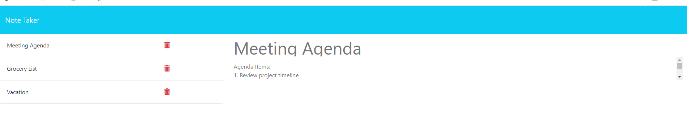

## Notebook Planner

## Table of Contents
- [Description](#description)
- [Task](#task)
- [Installation](#installation)
- [User Story](#user-story)
- [Acceptance Criteria](#acceptance-criteria)
- [Usage](#usage)
- [Tests](#tests)
- [Questions](#questions)
- [License](#license)

## Description

Notebook Planner is a user-friendly note-taking application built on Express.js, allowing users to easily create, manage, and access their notes. With a clean interface and intuitive design, users can write, save, edit, and delete notes seamlessly. Whether you're organizing tasks or jotting down ideas, Notebook Planner simplifies the process, ensuring efficient note management and boosting productivity.

## Your Task

Your assignment is to modify starter code to create an application called Note Taker that can be used to write and save notes. This application will use an Express.js back end and will save and retrieve note data from a JSON file.

The application’s front end has already been created. It's your job to build the back end, connect the two, and then deploy the entire application to Heroku.

## Installation

To install Notebook Planner, follow these steps:

1. Clone the repository from GitHub:  git clone https://github.com/your-username/notebook-planner.git
2. Navigate to the project directory: cd notebook-planner
3. Install dependencies: npm install
4. Start the application: node server.js
5. Access the application through your web browser at `http://localhost:3000`.

## User Story

AS A small business owner
I WANT to be able to write and save notes
SO THAT I can organize my thoughts and keep track of tasks I need to complete

## Acceptance Criteria

GIVEN a note-taking application
WHEN I open the Note Taker
THEN I am presented with a landing page with a link to a notes page
WHEN I click on the link to the notes page
THEN I am presented with a page with existing notes listed in the left-hand column, plus empty fields to enter a new note title and the note’s text in the right-hand column
WHEN I enter a new note title and the note’s text
THEN a "Save Note" button and a "Clear Form" button appear in the navigation at the top of the page
WHEN I click on the Save button
THEN the new note I have entered is saved and appears in the left-hand column with the other existing notes and the buttons in the navigation disappear
WHEN I click on an existing note in the list in the left-hand column
THEN that note appears in the right-hand column and a "New Note" button appears in the navigation
WHEN I click on the "New Note" button in the navigation at the top of the page
THEN I am presented with empty fields to enter a new note title and the note’s text in the right-hand column and the button disappears

## Usage

To use Notebook Planner, follow these steps:

1. Open the application in your web browser.

2. Upon landing on the homepage, click on the "Notes" link to navigate to the notes page.

3. On the notes page, you'll see existing notes listed in the left-hand column and empty fields to enter a new note title and text in the right-hand column.

4. Enter a new note title and text in the provided fields.

5. Once you've entered your note, a "Save Note" button and a "Clear Form" button will appear in the navigation at the top of the page.

6. Click on the "Save Note" button to save your new note. It will then appear in the left-hand column with the other existing notes.

7. To view the details of a specific note, simply click on the note in the left-hand column. Its details will be displayed in the right-hand column.

8. To create a new note, click on the "New Note" button in the navigation. This will clear the fields and allow you to enter a new note.

## Tests

To test Notebook Planner using Postman, follow these steps:

1. Open Postman and ensure that your local server is running.

2. Perform the following requests:

   - **GET Request**: 
     - Method: GET
     - URL: `http://localhost:3000/api/notes`
     - Expected Response: List of existing notes in JSON format.

   - **POST Request**: 
     - Method: POST
     - URL: `http://localhost:3000/api/notes`
     - Body: JSON object containing a new note's title and text.
      
       {
           "title": "Your Note Title",
           "text": "Your Note Text"
       }
   
     - Expected Response: Success message indicating the note has been saved.

   - **DELETE Request**: 
     - Method: DELETE
     - URL: `http://localhost:3000/api/notes/:id` (replace `:id` with the ID of the note you want to delete)
     - Expected Response: Success message indicating the note has been deleted.

3. Review the responses from Postman to ensure they match the expected behavior of the application.

4. You can also check the database or JSON file to verify that the changes made by the requests are reflected correctly.

## Questions

- **GitHub**: [daisy isibor](https://github.com/daisy isibor)
- **Email**: daisyisibor9@gmail.com

## License
  This project is licensed under the [GPLv3 License](https://www.gnu.org/licenses/gpl-3.0)